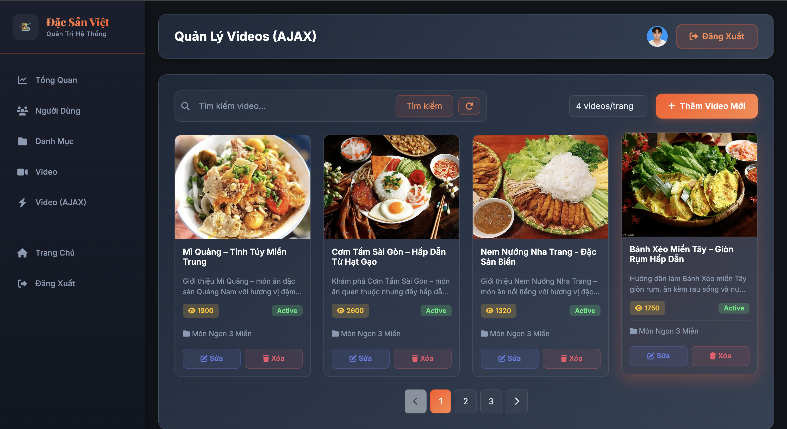

# 🍜 Đặc Sản Việt - Spring Boot Project

## 📌 Giới thiệu

Hệ thống quản lý đặc sản truyền thống Việt Nam được xây dựng bằng **Spring Boot + Thymeleaf + JPA Hibernate**.

Dự án cung cấp các chức năng:
- ✅ Quản lý người dùng (User Management)
- ✅ Quản lý danh mục đặc sản (Category Management)
- ✅ Quản lý video giới thiệu (Video Management)
- ✅ Phân quyền Admin/User với Spring Security
- ✅ Upload và quản lý hình ảnh
- ✅ Giao diện admin hiện đại với Thymeleaf

---

## 📂 Cấu trúc thư mục

```plaintext
SpringBootWithThymeLeaf/
├── src/main/java/LapTrinhWeb/SpringBoot/
│   ├── config/              # Cấu hình Spring Security, Password Encoder, Web Config
│   ├── controller/          # Controllers xử lý request
│   │   └── api/            # RESTful API Controllers
│   ├── entity/             # Entity classes (User, Category, Video)
│   ├── model/              # Model classes (DTO, Response)
│   ├── repository/         # JPA Repositories
│   ├── service/            # Business logic services
│   └── SpringBootWithThymeLeafApplication.java
│
├── src/main/resources/
│   ├── static/
│   │   ├── css/           # CSS files
│   │   ├── images/        # Static images
│   │   └── js/            # JavaScript files
│   ├── templates/
│   │   ├── admin/         # Admin pages (dashboard, users, categories, videos)
│   │   ├── auth/          # Authentication pages (login, register)
│   │   ├── layouts/       # Layout templates
│   │   └── index.html     # Home page
│   └── application.properties
│
├── screenshots/            # Project screenshots for documentation
├── uploads/                # Uploaded images (auto-created, gitignored)
├── pom.xml                 # Maven dependencies
├── README.md               # Project documentation
└── PROJECT_SUMMARY.md      # Project summary
```

---

## 🚀 Hướng dẫn sử dụng

### 1. Cài đặt và chạy dự án

**Clone project từ GitHub:**
```bash
git clone https://github.com/teehihi/DacSanVietSpringBoot.git
cd DacSanVietSpringBoot
```

**Cấu hình database trong `src/main/resources/application.properties`:**
```properties
server.port=8088

# Database Configuration
spring.datasource.driverClassName=com.microsoft.sqlserver.jdbc.SQLServerDriver
spring.datasource.url=jdbc:sqlserver://localhost:1433;databaseName=QuanLySVSpringDB;trustServerCertificate=true;encrypt=true;
spring.datasource.username=sa
spring.datasource.password=YourPassword

# JPA/Hibernate
spring.jpa.hibernate.ddl-auto=update
spring.jpa.show-sql=true
```

⚠️ **Lưu ý:** Đảm bảo đã tạo database `QuanLySVSpringDB` trong SQL Server trước khi chạy.

**Chạy dự án:**
```bash
mvn spring-boot:run
```

Hoặc sử dụng **Spring Tool Suite (STS)**:
1. Mở Boot Dashboard
2. Chuột phải vào project → Chọn **(Re)start**
3. Truy cập: `http://localhost:8088`

---

## 🔐 Cấu hình tài khoản Admin

### Cách 1: Sử dụng Utility Endpoint (Khuyến nghị)

Truy cập endpoint sau để hash password cho user:
```
http://localhost:8088/utility/hash-password/{username}/{plainPassword}
```

**Ví dụ:**
```
http://localhost:8088/utility/hash-password/admin/admin123
```

### Cách 2: Đăng ký và cập nhật qua Database

1. **Đăng ký tài khoản mới** qua trang `/register`
2. **Kết nối SQL Server** và chạy:
```sql
UPDATE users SET admin = 1 WHERE username = 'your_username';
```

### Cách 3: Tạo user admin trực tiếp trong Database

```sql
INSERT INTO users (username, password, fullname, email, phone, admin, active, images)
VALUES (
    'admin',
    '$2a$10$N9qo8uLOickgx2ZMRZoMyeIjZAgcfl7p92ldGxad68LJZdL17lhWy', -- password: admin123
    'Administrator',
    'admin@example.com',
    '0123456789',
    1, -- admin = true
    1, -- active = true
    NULL
);
```

**Thông tin đăng nhập:**
- Username: `admin`
- Password: `admin123`

---

## 🎨 Tính năng nổi bật

### 🔒 Bảo mật
- ✅ Password được mã hóa bằng **BCrypt**
- ✅ Session management

### 📸 Quản lý File
- ✅ Upload ảnh với **Multipart**
- ✅ Lưu trữ file ngoài project (không cần restart)
- ✅ Hỗ trợ URL và file upload
- ✅ Tự động tạo thư mục `uploads/`

### 🎯 Giao diện
- ✅ Admin dashboard hiện đại
- ✅ Responsive design
- ✅ Dark theme với gradient đẹp
- ✅ Modal xác nhận tùy chỉnh
- ✅ Alert messages đẹp mắt
- ✅ Font chữ đẹp (Playfair Display + Inter)

### 📊 Dashboard
- ✅ Thống kê real-time (Users, Categories, Videos)
- ✅ Biểu đồ Chart.js
- ✅ Hoạt động gần đây
- ✅ Thao tác nhanh

### ⚡ AJAX Features
- ✅ Quản lý Video với AJAX (không reload trang)
- ✅ Tìm kiếm real-time
- ✅ Phân trang động
- ✅ CRUD không reload trang
- ✅ Upload ảnh với preview
- ✅ Loading spinner

---

## 🌐 Các trang chính

| Trang | URL | Mô tả |
|-------|-----|-------|
| Trang chủ | `/` | Trang chủ giới thiệu đặc sản |
| Đăng nhập | `/login` | Đăng nhập hệ thống |
| Đăng ký | `/register` | Đăng ký tài khoản mới |
| Dashboard | `/admin/dashboard` | Tổng quan hệ thống |
| Quản lý Users | `/admin/users` | CRUD người dùng |
| Quản lý Categories | `/admin/categories` | CRUD danh mục |
| Quản lý Videos | `/admin/videos` | CRUD video (Thymeleaf) |
| Quản lý Videos AJAX | `/admin/videos-ajax` | CRUD video (AJAX) |

---

## 🛠️ Công nghệ sử dụng

- **Backend:** Spring Boot 3.5.8
- **Template Engine:** Thymeleaf
- **Database:** SQL Server
- **ORM:** JPA Hibernate
- **Build Tool:** Maven
- **Frontend:** Bootstrap 5.3.3, Font Awesome 6.5.1, Chart.js 4.4.0
- **Fonts:** Google Fonts (Playfair Display, Inter)

---

## 📸 Screenshots

### Trang chủ


### Admin Dashboard


*Dashboard với thống kê real-time và biểu đồ*

### Quản lý Users


*Giao diện quản lý người dùng với search và pagination*

---

## 🔧 Cấu hình nâng cao

### Upload File Configuration

Ảnh được lưu vào thư mục `uploads/` ở root project:
```
project-root/
├── uploads/           # Ảnh upload (tự động tạo)
│   ├── abc-123.jpg
│   └── xyz-456.png
└── src/
```

Truy cập ảnh qua URL: `/uploads/{filename}`

### Database Schema

Hệ thống tự động tạo bảng với `spring.jpa.hibernate.ddl-auto=update`:
- `users` - Thông tin người dùng
- `categories` - Danh mục đặc sản
- `videos` - Video giới thiệu

---

## 🐛 Troubleshooting

### Lỗi kết nối database
```
Kiểm tra:
- SQL Server đã chạy chưa?
- Database QuanLySVSpringDB đã tạo chưa?
- Username/password đúng chưa?
- Port 1433 có bị block không?
```

### Ảnh không hiển thị
```
Kiểm tra:
- Thư mục uploads/ đã được tạo chưa?
- WebConfig đã cấu hình đúng chưa?
- Đường dẫn ảnh trong DB có đúng không?
```

### Không đăng nhập được
```
Kiểm tra:
- Password đã được hash chưa?
- User có active = 1 không?
- Có lỗi trong console không?
```

---

## ⚡ AJAX Video Management

Hệ thống cung cấp trang quản lý Video sử dụng **AJAX** để thực hiện CRUD không reload trang.

### 🎯 Truy cập

```
http://localhost:8088/admin/videos-ajax
```

### ✨ Tính năng AJAX

1. **Hiển thị danh sách video:**
   - Load dữ liệu từ API bằng AJAX
   - Hiển thị dạng grid với card đẹp
   - Không reload trang

2. **Tìm kiếm real-time:**
   - Gõ từ khóa → Tự động tìm kiếm
   - Debounce 500ms để tối ưu
   - Kết quả hiển thị ngay lập tức

3. **Phân trang động:**
   - Chuyển trang không reload
   - Hiển thị số trang, tổng số video
   - Có nút Previous/Next

4. **Thêm video mới:**
   - Modal form với Bootstrap
   - Upload ảnh với preview
   - Gửi FormData qua AJAX
   - Thông báo thành công/lỗi

5. **Sửa video:**
   - Load dữ liệu video qua AJAX
   - Hiển thị ảnh hiện tại
   - Cập nhật không reload trang

6. **Xóa video:**
   - Confirm trước khi xóa
   - Xóa qua AJAX
   - Cập nhật danh sách ngay lập tức

### 🔧 Cách hoạt động

**Backend (REST API):**
- GET `/api/video` - Lấy danh sách
- POST `/api/video/addVideo` - Thêm mới
- PUT `/api/video/updateVideo` - Cập nhật
- DELETE `/api/video/deleteVideo` - Xóa

### 📊 So sánh Thymeleaf vs AJAX

| Tính năng | Thymeleaf | AJAX |
|-----------|-----------|------|
| Reload trang | ✅ Có | ❌ Không |
| Tốc độ | Chậm hơn | Nhanh hơn |
| UX | Bình thường | Mượt mà |
| SEO | Tốt | Kém hơn |
| Phức tạp | Đơn giản | Phức tạp hơn |

---

### Giao diện hiển thị Video với AJAX



*Giao diện được thiết kế gồm phân trang và cả chức năng tìm kiếm video*


*Dùng AJAX cho phép thực hiện các thao tác CRUD mà không cần phải load trang*

---

## 🔌 RESTful API

Hệ thống cung cấp RESTful API cho Video CRUD với Swagger 3 documentation.

### 🎯 Truy cập API Documentation

**Swagger UI (Khuyến nghị):**
```
http://localhost:8088/swagger-ui/index.html
```


*SwaggerUI với giao diện cho phép test API một cách dễ dàng và trực quan*

**OpenAPI JSON:**
```
http://localhost:8088/v3/api-docs
```

### 📋 API Endpoints

#### 1. Lấy tất cả video (có phân trang và tìm kiếm)
```http
GET /api/video?title={title}&page={page}&size={size}&sort={sort}
```

**Parameters:**
- `title` (optional): Tìm kiếm theo tiêu đề
- `page` (optional, default: 0): Số trang
- `size` (optional, default: 10): Số lượng mỗi trang
- `sort` (optional, default: videold): Trường sắp xếp

**Response:**
```json
{
  "status": true,
  "message": "Lấy danh sách video thành công",
  "body": {
    "content": [...],
    "totalElements": 100,
    "totalPages": 10,
    "size": 10,
    "number": 0
  }
}
```

#### 2. Lấy thông tin video theo ID
```http
POST /api/video/getVideo
Content-Type: multipart/form-data

id=1
```

**Response:**
```json
{
  "status": true,
  "message": "Lấy thông tin video thành công",
  "body": {
    "videold": 1,
    "title": "Video Title",
    "description": "Description",
    "poster": "filename.jpg",
    "views": 100,
    "active": true,
    "category": {...}
  }
}
```

#### 3. Thêm video mới
```http
POST /api/video/addVideo
Content-Type: multipart/form-data

title=Video Title
description=Video Description
categoryId=1
poster=@file.jpg
active=true
```

**Response:**
```json
{
  "status": true,
  "message": "Thêm video thành công",
  "body": {...}
}
```

#### 4. Cập nhật video
```http
PUT /api/video/updateVideo
Content-Type: multipart/form-data

videold=1
title=Updated Title
description=Updated Description
categoryId=1
poster=@newfile.jpg
active=true
```

**Response:**
```json
{
  "status": true,
  "message": "Cập nhật video thành công",
  "body": {...}
}
```

#### 5. Xóa video
```http
DELETE /api/video/deleteVideo
Content-Type: multipart/form-data

videold=1
```

**Response:**
```json
{
  "status": true,
  "message": "Xóa video thành công",
  "body": {...}
}
```

### 🧪 Test API với Swagger UI (Khuyến nghị)

Swagger UI cung cấp giao diện đẹp và dễ sử dụng để test API.

**Các bước test:**

1. **Truy cập Swagger UI:**
   ```
   http://localhost:8088/swagger-ui/index.html
   ```

2. **Chọn endpoint muốn test** (ví dụ: `POST /api/video/addVideo`)

3. **Click "Try it out"**

4. **Điền thông tin:**
   - `title`: Bánh mì Sài Gòn
   - `description`: Món ăn đường phố nổi tiếng
   - `categoryId`: 1
   - `poster`: Click "Choose File" để chọn ảnh
   - `active`: true

5. **Click "Execute"**

6. **Xem kết quả** trong phần Response:
   - Status code: 200
   - Response body: JSON với thông tin video vừa tạo
   


**Ưu điểm của Swagger UI:**
- ✅ Giao diện đẹp, trực quan
- ✅ Tự động generate documentation
- ✅ Upload file dễ dàng
- ✅ Xem response ngay lập tức
- ✅ Không cần cấu hình gì thêm

### 📮 Test API với Postman

**Chuẩn bị:**

1. **Xóa cookies cũ:**
   - Click icon **Cookies** (hình bánh quy) bên dưới nút Send
   - Tìm domain `localhost:8088`
   - Click **Remove All**

2. **Thêm header:**
   - Key: `Accept`
   - Value: `application/json`

**Test các endpoint:**

#### 1. GET - Lấy danh sách video
```
Method: GET
URL: http://localhost:8088/api/video
Params:
  - title: (optional)
  - page: 0
  - size: 10
  - sort: videold
```

#### 2. POST - Thêm video mới
```
Method: POST
URL: http://localhost:8088/api/video/addVideo
Body: form-data
  - title: Bánh mì Sài Gòn
  - description: Món ăn đường phố
  - categoryId: 1
  - poster: [Select File - chọn type "File"]
  - active: true
```

**Lưu ý quan trọng:**
- Chọn Body → **form-data** (không phải raw JSON)
- Field `poster` phải chọn type **File** (không phải Text)
- Tất cả fields phải tick checkbox

#### 3. PUT - Cập nhật video
```
Method: PUT
URL: http://localhost:8088/api/video/updateVideo
Body: form-data
  - videold: 1
  - title: Bánh mì Sài Gòn - Updated
  - description: Mô tả mới
  - categoryId: 1
  - poster: [Select File] (optional)
  - active: true
```

#### 4. DELETE - Xóa video
```
Method: DELETE
URL: http://localhost:8088/api/video/deleteVideo
Body: form-data
  - videold: 1
```

**Troubleshooting Postman:**

❌ **Lỗi 401 Unauthorized:**
- Xóa cookies: Cookies → Remove All
- Kiểm tra URL đúng: `http://localhost:8088/api/...`

❌ **Lỗi 302 Found (redirect):**
- Restart Spring Boot application
- Xóa cookies trong Postman
- Thêm header `Accept: application/json`

❌ **Response trả về HTML thay vì JSON:**
- Đang bị redirect về trang login
- Xóa cookies và restart application

### 🔧 Test API với cURL

```bash
# GET - Lấy danh sách video
curl http://localhost:8088/api/video

# POST - Thêm video mới
curl -X POST http://localhost:8088/api/video/addVideo \
  -F "title=Bánh mì Sài Gòn" \
  -F "description=Món ăn đường phố" \
  -F "categoryId=1" \
  -F "active=true" \
  -F "poster=@/path/to/image.jpg"

# PUT - Cập nhật video
curl -X PUT http://localhost:8088/api/video/updateVideo \
  -F "videold=1" \
  -F "title=Bánh mì Sài Gòn - Updated" \
  -F "description=Mô tả mới" \
  -F "categoryId=1" \
  -F "active=true"

# DELETE - Xóa video
curl -X DELETE http://localhost:8088/api/video/deleteVideo \
  -F "videold=1"
```

### 📝 Lưu ý khi sử dụng API

**Bảo mật:**
- ✅ API không yêu cầu authentication (public API)
- ✅ CSRF protection đã disable cho API
- ✅ Session management: STATELESS (không tạo session)

**Upload File:**
- ✅ Hỗ trợ định dạng: JPG, PNG, GIF
- ✅ Kích thước file tối đa: 10MB
- ✅ File được lưu vào thư mục `uploads/`
- ✅ Truy cập ảnh qua: `/uploads/{filename}`

**Response Format:**
- ✅ Tất cả response đều có format: `{status, message, body}`
- ✅ `status: true` - Thành công
- ✅ `status: false` - Thất bại
- ✅ `message` - Mô tả kết quả
- ✅ `body` - Dữ liệu trả về (hoặc null nếu lỗi)

**Phân trang:**
- ✅ GET /api/video hỗ trợ phân trang
- ✅ Parameters: `page`, `size`, `sort`
- ✅ Response có: `totalElements`, `totalPages`, `number`

**Tìm kiếm:**
- ✅ GET /api/video?title={keyword}
- ✅ Tìm kiếm theo tiêu đề video
- ✅ Kết hợp với phân trang

---

## 📝 TODO

- [x] RESTful API cho Video CRUD
- [x] Swagger 3 documentation
- [x] AJAX Video Management (CRUD không reload trang)
- [x] Tìm kiếm và phân trang với AJAX
- [ ] Thêm API cho Category và User
- [ ] Export dữ liệu ra Excel/PDF
- [ ] Thêm email notification
- [ ] Tích hợp payment gateway
- [ ] Mobile app với React Native

---

## 🧑‍💻 Tác giả

**Nguyễn Nhật Thiên (TEE)**

- 📧 Email: teeforwork21@gmail.com
- 🔗 GitHub: [github.com/teehihi](https://github.com/teehihi)
- 🌐 Linktree: [linktr.ee/nkqt.tee](https://linktr.ee/nkqt.tee)

---

## 📄 License

Dự án này được phát triển cho mục đích học tập tại **Trường Đại học Sư phạm Kỹ thuật TP.HCM**.

---

## 🙏 Acknowledgments

- Spring Boot Documentation
- Thymeleaf Documentation
- Bootstrap Team
- Font Awesome
- Chart.js Team

---

**⭐ Nếu thấy project hữu ích, hãy cho một star nhé! ⭐**
